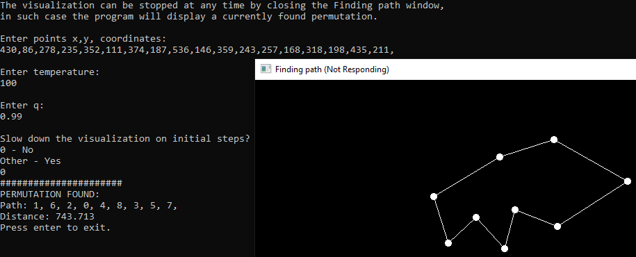

# Visualizing finding optimal route for TSP, using simulated annealing
## Course project assignment
**Project summary:** [ProjectB.pdf](ProjectB.pdf)

Visualized using SFML version 2.5.1 for GCC 7.3.0 MinGW (DW2). Libraries for static linking are inside SFML/lib folder.

### Examples:
Points are cities, every city is connected to every other city, input is entered into the console window. After entering all data the visualization window opens, the window dimensions are 800x600.

Visualization result:

Visualization example:

High temperature:


### How to:
**Points input format:** pair of integers, each integer followed by a ``` , ```. The first integer of a pair is between ``` 0 ``` and ``` 800 ``` , and the second one is between ``` 0 ``` and ``` 600 ```. A pair creates a point, more pairs create more points. E.g. input: ``` 10,10,200,40,300,200,40,500, ```  translates into four points, (10,10), (200,40), (300,200), (40,500).
**Temperature:** is a float number larger than ``` 0.1 ```.
**q:** is a float number smaller than ``` 1 ``` and larger than ``` 0 ```.
**slow down:** ``` 1 ``` - slows down the visualization (beginning steps are made much slower), ``` 0 ``` - without slowing.

##### Important:
**If you are happy with the result but the visualization still hasn't stopped, please close the ``` Finding path ``` window - the program will print out found permutation and it's distance onto the console.**

**If the program found a path then ``` Finding path ``` window freezes and can only be closed by focusing the console window and pressing enter, or by closing console manually.**


**Numbers making a point can be any integer, they just won't show in the window.**

### Sample inputs:
Points x,y, coordinates: ``` 430,86,278,235,352,111,374,187,536,146,359,243,257,168,318,198,435,211, ```
Temperature: ``` 100 ```
q: ``` 0.999 ```

Points x,y, coordinates: ``` 334,195,404,193,240,235,327,231,91,216,374,177,372,214,275,307,555,218,481,448,201,147,268,392,198,456,170,289,426,378,385,246,325,359, ```
Temperature: ``` 5 ```
q: ``` 0.9999 ```